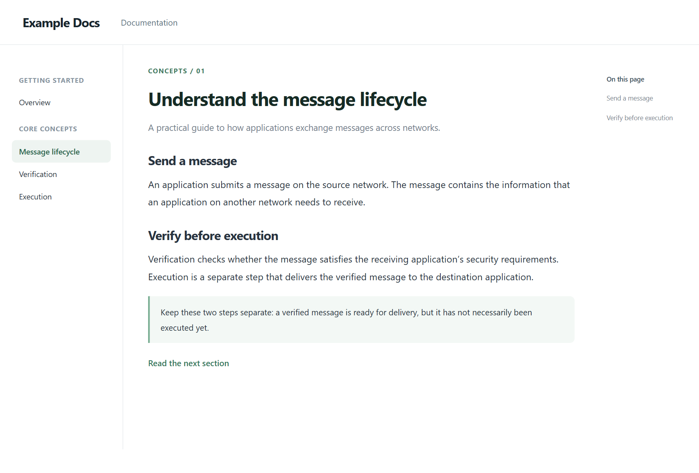
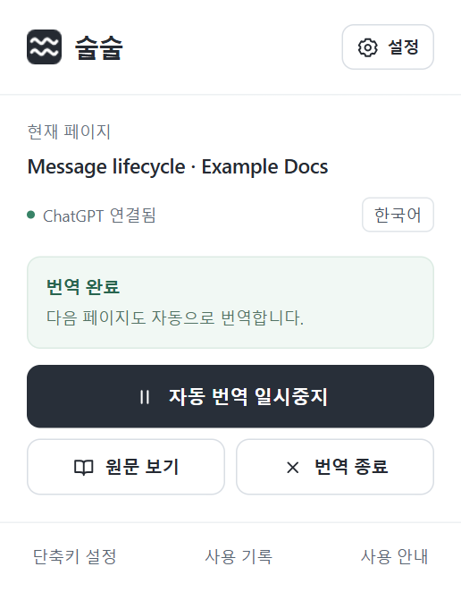

# 술술 — AI 웹 번역기

**ChatGPT로 웹페이지를 읽던 자리에서 원하는 언어로 자연스럽게 읽으세요.**

**술술(Sulsul)**은 내 ChatGPT 계정으로 문서, 기사, 게시글, 댓글을 페이지 안에서 번역하는 Chrome 확장 프로그램입니다. 링크·강조·코드를 보존하고, 동적으로 추가되는 글도 읽습니다.

현재 버전은 **0.14.5**입니다. Chrome 120 이상과 Windows·macOS 설치를 지원합니다. Linux용 설치 프로그램과 Chrome 웹 스토어 버전은 아직 제공하지 않습니다. [변경 기록](CHANGELOG.md) · [설치 가이드](docs/installation.md) · [배포자 가이드](docs/publishing.md).

설정에서 한국어·영어·일본어·중국어(간체/번체)·스페인어·프랑스어·독일어를 선택할 수 있습니다. 원문 언어는 자동 판단하며 캐시는 목표 언어별로 구분합니다. 설정 UI는 현재 한국어입니다.

## 미리 보기

읽던 페이지에서 본문과 메뉴를 번역합니다. 오른쪽 아래의 네비게이션 버튼으로 원문 보기·일시중지·종료 등을 조작하고 설정을 열 수 있습니다.


<details>
<summary>번역 전 원문 보기</summary>



</details>

확장 아이콘을 누르면 현재 페이지와 번역 상태를 확인하고, 자동 번역을 멈추거나 원문으로 돌아갈 수 있습니다.



위 이미지는 예시 문서와 미리 준비한 번역·연결 상태로 촬영한 실제 확장 UI입니다. AI 번역 품질이나 속도를 측정한 화면은 아닙니다.


## 어떤 방식으로 사용할까요?

술술은 **Chrome 확장 + PC 연결 프로그램 + 본인 ChatGPT 계정**이 모두 필요합니다. 설치 방식과 관계없이 같습니다. 별도 웹 서버를 배포하거나 공용 API 키를 준비할 필요는 없습니다.

| 목적 | 설치·배포 경로 | 현재 상태 |
| --- | --- | --- |
| 제작자가 올린 버전을 바로 사용 | 스토어에서 확장 설치 + 같은 배포자의 PC 연결 프로그램 설치 | 스토어 미출시. 공개 후 이곳에 링크 제공 |
| 지금 ZIP으로 바로 사용 | [Releases](https://github.com/viviviviviid/sulsul/releases/latest) 다운로드 + PC 설치 + 확장을 개발자 모드로 로드 | 사용 가능 |
| 저장소를 직접 받아 사용·수정 | clone 또는 소스 ZIP + 설치 스크립트 + 확장을 개발자 모드로 로드 | 사용 가능. 포크·스토어 등록 불필요 |
| 내 이름으로 다른 사람에게 배포 | 내 저장소·릴리스 또는 내 스토어 항목 + 내 확장 ID에 맞는 연결 프로그램 | [배포자 가이드](docs/publishing.md)에 따라 직접 구성 |

**스토어에 올라간 확장도 PC 연결 프로그램이 필요합니다.** 스토어 사용자는 개발자 모드와 소스 다운로드가 필요 없으며, 설치 앱의 `extension` 폴더 로드 단계는 건너뜁니다. 확장과 연결 프로그램은 같은 배포자의 것을 사용하세요.

### 지금 설치하기

- **Windows:** Node.js 22 이상 설치 → Windows ZIP 압축 해제 → `install.cmd` → `chrome://extensions`의 개발자 모드에서 `extension` 폴더 로드.
- **Apple Silicon Mac(macOS 13.5 이상):** Mac ZIP 압축 해제 → `술술 설치.app` → 안내받은 폴더를 개발자 모드로 로드. Node.js와 개발 도구는 별도로 필요하지 않습니다. 현재 설치 앱에는 Apple Developer ID 서명·공증이 없습니다.
- **소스:** 저장소를 내려받고 `npm ci` → Windows는 `install.cmd`, Mac은 `bash install.command` → 소스의 `extension` 폴더 로드.

설치 후 술술의 **ChatGPT 연결**에서 로그인하고 웹페이지의 **우클릭 → 술술 번역**으로 시작하세요. 공식 Codex 연결 프로그램은 첫 연결 때 다운로드·검증합니다. 다음부터는 Chrome이 필요할 때 실행하므로 터미널을 켜둘 필요가 없습니다.

자세한 [운영체제별 설치·업데이트·삭제](docs/installation.md)와 [간단 설치 안내](설치안내.txt)를 참고하세요.

## ChatGPT 연결과 사용 한도

ChatGPT 계정으로 공식 Codex에 로그인하며 **해당 계정의 Codex 이용 한도**가 적용됩니다. ChatGPT 대화의 남은 횟수를 그대로 가져오는 기능은 아닙니다. 계정에서 Codex 사용 권한이 있어야 합니다. 로그인과 연결 확인은 인증 상태만 확인하며 AI를 호출하지 않습니다. 모델 사용 가능 여부와 한도는 실제 번역 시 확인합니다.

기본 모델은 계정 기본값인 `default`이며 Fast 모드는 꺼져 있습니다. **ChatGPT 설정 → 모델 설정**에서 목록의 모델을 고르거나 **직접 입력**으로 Codex 모델 ID를 지정할 수 있습니다. 목록은 고정된 선택지이며 실제 사용 가능 여부는 계정에 따라 다릅니다. 저장 후 **연결 확인**으로 확인하세요.

**Fast 모드**는 지원되는 모델에서 속도를 높이는 대신 사용량이 더 차감됩니다. 지원 모델과 차감 기준은 [OpenAI Fast 모드 안내](https://learn.chatgpt.com/docs/agent-configuration/speed)를 따릅니다. 모델·Fast 설정을 저장하면 진행 중인 번역을 원문으로 돌리고 일시중지합니다. 페이지에서 **이어 읽기**를 누르면 저장한 설정으로 번역합니다.

별도 API 키 연결이나 유료 API 자동 전환은 제공하지 않습니다. 한도·인증 오류는 자동 재시도하지 않습니다. [연결 설명](docs/providers.md).

## 읽는 방법

- 첫 팝업에서 단축키 사용 여부를 선택하세요. Chrome 설정에서 **술술 실행**에 **Alt + Shift + S**를 배정하는 것을 권장합니다. 다른 확장과 겹치면 다른 키를 선택하세요. 다시 눌러도 번역을 멈추지 않습니다.
- 우클릭 → 술술 번역 또는 팝업의 번역 시작을 누르세요. 기존에 배정한 단축키도 유지됩니다.
- 한 번 켜면 같은 탭·같은 사이트의 다음 페이지도 자동으로 번역합니다.
- 반투명 **네비게이션 버튼**에 커서를 올리면 **원문·일시중지·종료·숨기기·설정**을 사용할 수 있습니다. 드래그하면 네 모서리로 옮길 수 있습니다.
- 오류가 나면 오류 안내와 다시 시도 버튼이 표시됩니다. 번역에 실패한 문단은 원문을 유지합니다.
- PDF·이미지·iframe·입력창은 번역하지 않습니다. Chrome 기본 번역은 끄고 사용하세요.

번역된 문단에 커서를 잠깐 올리면 그 문단의 원문을 볼 수 있습니다. 링크나 코드로 나뉜 조각도 문단 단위로 합쳐 보여줍니다. 툴팁 안에서 원문을 선택·복사하거나 긴 내용을 스크롤할 수 있고, Esc로 닫습니다. 원문 확인은 AI를 호출하지 않습니다.

## 네비게이션 버튼 모션

설정의 **네비게이션 버튼 모션**에서 모두 섞기·장난꾸러기·빙글빙글·접었다 펴기·숨 고르기·잔물결·정지 중 선택할 수 있습니다. 미리보기를 보고 고르면 번역을 멈추지 않고 열린 페이지에 바로 적용됩니다. 모션과 미리보기는 AI를 사용하지 않습니다.

## 사용 기록

날짜별 추이(오늘은 시간별), 모델·사이트·Fast 설정·요청 종류별 비교, 완료·실패·취소 비율을 차트로 볼 수 있습니다. 지표는 전체·입력·출력 토큰, 요청 수, API 환산액, 평균 처리 시간 중 선택합니다. 차트와 내역에 같은 기간·모델 필터가 적용되고, 미확인 값은 합계·평균에서 제외됩니다. 차트 조회는 AI를 호출하지 않습니다.

팝업의 **사용 기록** 또는 **설정 → 기록 보기**에서 날짜·모델별 입력/출력 토큰, AI 캐시 읽기·쓰기, 처리 시간과 요청 결과를 확인하고 CSV로 내려받을 수 있습니다. 연결 프로그램 업데이트 이후의 번역 요청부터 기록합니다. 이전 버전의 로그인·연결 확인 번역 기록은 남지만, 0.12.3부터 이 과정은 AI를 호출하지 않습니다. 저장된 번역을 재사용한 경우에는 AI 요청을 추가하지 않습니다.

**API 환산액은 실제 청구액이 아닙니다.** 공식 공개 단가를 적용한 USD 참고치이며, 술술은 계속 Codex 구독 한도를 사용합니다. Spark처럼 공개 API 단가가 없거나 토큰이 전달되지 않은 요청은 비용을 추정하지 않습니다. 실제 계정의 남은 사용 한도나 다른 앱에서 쓴 사용량을 보여주는 기능은 아닙니다.

기록은 이 PC의 연결 프로그램에 최근 30일·최대 1,000건 보관합니다. 사이트 도메인과 모델·사용량만 저장하고 문서 본문·번역문·전체 URL·계정 정보는 저장하지 않습니다. 사용 기록 화면에서 지울 수 있습니다.

## 반복 입력과 캐시

술술의 번역 결과 캐시는 같은 원문을 다시 번역하지 않도록 합니다. AI 서버의 입력 캐시는 별개이며, 고정 지침은 앞부분에 일정하게 배치합니다. 현재 Codex 구독 연결 인터페이스에서는 캐시 키·보관 시간·캐시 경계를 직접 지정하지 않습니다. 재사용 여부는 사용 기록의 **캐시 읽기**로 확인할 수 있고, 0이면 해당 요청에는 캐시 읽기가 보고되지 않은 것입니다. 캐시에 적중해도 Input 합계에는 캐시 입력이 포함됩니다.

페이지 전체 제목 목록·도입부·뒤 문단은 보내지 않습니다. 참고용 앞 문단은 같은 구역에서 최대 280자씩, 요청당 합계 560자로 제한합니다. 페이지 주소와 캐시 메타데이터는 로컬 처리에만 사용하며, 원문 자체에 포함된 주소는 번역 대상 그대로 전달됩니다. 고정 지침을 압축하고 짧은 메뉴·제목을 최대 24개씩 묶어 전송합니다. 현재 화면과 아래 두 화면까지만 미리 번역합니다. 긴 본문은 현재 화면에서 4~8개씩 빠르게 처리하고, 바로 아래는 최대 12개·5,000글자, 그 다음 화면은 최대 24개·12,000글자로 묶습니다. 더 먼 내용은 스크롤로 가까워질 때 요청합니다. 다른 탭을 보는 동안에는 새 요청을 멈추고, 이미 보낸 결과는 받아서 캐시에 저장합니다. 캐시를 채우기 위한 별도 AI 요청은 하지 않습니다. API의 캐시 지원 조건이 구독 한도 절감률을 보장하지는 않습니다. [OpenAI 입력 캐시 문서](https://developers.openai.com/api/docs/guides/prompt-caching)

사용 기록의 **이전 요청과 겹침**은 보관 중인 기록에서 같은 원문·문맥·모델 설정으로 다시 요청된 문단 수입니다. 로컬 비밀키로 만든 비교값만 저장하며 원문은 기록하지 않습니다. 재시도나 캐시 삭제 후에도 겹칠 수 있으므로 곧바로 오류를 뜻하지 않습니다. CSV의 요청 ID와 문단 묶음 식별값으로 요청을 비교할 수 있습니다. 업데이트 이전 기록은 비교할 수 없습니다.

## 저장된 번역

문단별로 번역을 저장해 요청 묶음이나 수집 순서가 바뀌어도 다시 사용합니다. 메뉴는 같은 출처의 다른 페이지에서, 본문은 같은 문서·제목·절 안에서 재사용합니다. 일부 문단만 바뀌면 바뀐 문단만 새로 요청합니다.

캐시는 번역 언어·모델·Fast 설정별로 구분하며 이 Chrome 프로필에 최대 약 3MB·1,500항목을 보관합니다. 오래된 항목부터 제거하고, 설정의 **저장된 번역 지우기**로 삭제할 수 있습니다.

## 업데이트

- **스토어 공개 후:** 확장은 Chrome이 업데이트하지만, PC 연결 프로그램은 새 설치 파일을 직접 실행해야 합니다. 연결 프로그램에는 자체 자동 업데이트 기능이 없습니다.
- **Windows ZIP:** 새 ZIP의 같은 이름 파일을 기존 설치 폴더에 덮어쓰고 `install.cmd`를 다시 실행하세요.
- **Mac 설치 앱:** 새 Mac ZIP을 풀고 `술술 설치.app`을 다시 실행하세요. 기존 Application Support 폴더의 연결 프로그램과 확장이 갱신됩니다.
- **소스 설치:** `git pull --ff-only`와 `npm ci` 후 Windows는 `install.cmd`, Mac은 `bash install.command`를 실행하세요.

연결 프로그램 갱신 전에는 읽기를 종료하고 Chrome을 완전히 닫으세요. 재설치 후 ZIP·소스 확장은 `chrome://extensions`에서 새로고침하고 읽던 웹페이지도 새로고침합니다. 같은 ID·설치 경로로 업데이트하면 로그인·설정이 유지됩니다. 스토어·포크로 설치 경로를 바꾸면 ID가 달라질 수 있으므로 [전환 안내](docs/installation.md#업데이트와-설치-경로-전환)를 따르세요.

0.9.0부터 ChatGPT만 지원합니다. 이전에 다른 AI를 골랐어도 ChatGPT로 전환됩니다. 기존 Codex 로그인과 모델 설정은 유지됩니다. 이전 제공자의 로그인 자료는 자동 삭제하지 않지만 사용하지 않습니다. 다른 AI만 연결했던 사용자는 ChatGPT 연결이 한 번 필요합니다.

## 개인정보

번역 대상 텍스트, 짧은 인접 원문, 페이지 및 문단 제목은 OpenAI로 전달됩니다. 인증은 이 PC의 공식 Codex가 관리하며 확장은 비밀번호나 토큰을 받지 않습니다. 번역 결과는 Chrome 프로필에 저장하고 설정에서 지울 수 있습니다. [개인정보 안내](PRIVACY.md).

## 개발·포크

개인 사용에는 포크가 필요하지 않습니다. 수정본을 내 저장소에서 관리하려면 포크한 주소를 사용하세요. 아래 명령은 소스를 받고 검증하는 절차이며, 로컬 사용에는 [PC 연결 프로그램 설치](docs/installation.md#저장소에서-직접-설치)도 필요합니다.

```sh
git clone https://github.com/viviviviviid/sulsul.git
cd sulsul
npm ci
npm run check
npm test
npx playwright install chromium
npm run test:browser
```

Node.js 22 이상이 필요하며 CI는 Node.js 24를 사용합니다. npm 런타임 의존성은 없고 Playwright는 브라우저 테스트에만 사용합니다. 실제 번역에는 첫 연결 때 내려받는 공식 Codex 실행 파일이 필요합니다. 자동 테스트는 모의 응답으로 로그인 상태, 번역 조각 누락, 모델·Fast 설정, 취소, 문단 캐시, 본문 우선순위, 원문 복원과 페이지 이동을 검증합니다. 실제 계정 접근과 번역 품질은 로그인 후 확인하세요.

`npm run package`는 Windows 설치 ZIP, `npm run package:source`는 소스 ZIP, `npm run package:extension`은 확장 ZIP을 `dist/`에 만듭니다. 이 세 명령은 Windows와 macOS에서 실행할 수 있습니다. Mac 설치 앱은 macOS에서 `npm run package:macos`로 만듭니다. 확장 ZIP만 설치한 경우에도 PC의 연결 프로그램이 필요합니다. [배포 안내](docs/publishing.md) · [기여 안내](CONTRIBUTING.md) · [구조 설명](docs/architecture.md).

## 라이선스

[MIT](LICENSE). 저작권 고지와 라이선스를 유지해 그대로 사용·수정·재배포할 수 있습니다. 독립 배포자는 자신의 설치 파일·업데이트·지원·개인정보 안내를 관리합니다. [독립 배포 시 설정](docs/publishing.md#독립-포크-배포).

술술은 OpenAI가 제작하거나 제휴한 공식 확장 프로그램이 아닙니다. 술술의 라이선스는 별도로 내려받는 Codex와 해당 서비스의 이용 조건을 대체하지 않습니다.
